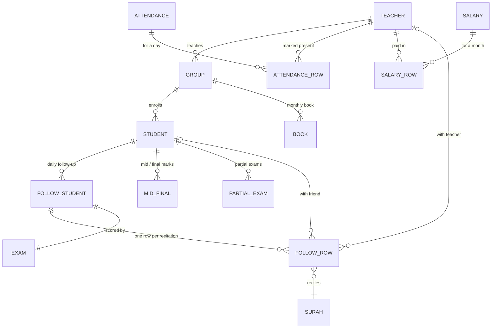

# Jaberah API

Management system for a Quran school — students, study circles, teachers,
attendance, memorization follow-up, exams, salaries and reports.

ASP.NET Core 9 Web API backing a [Flutter mobile client](https://github.com/MohamedSaeed-dev/Jaberah-Flutter),
deployed to production on every push to `master`.

[](https://github.com/MohamedSaeed-dev/Jaberah-ASP/actions/workflows/ci.yml)
[](https://github.com/MohamedSaeed-dev/Jaberah-ASP/actions/workflows/main.yml)

---

## The problem

A Quran school tracks each student's memorization progress by hand: which
`surah` they recited, on which day, with which teacher or study partner, how
they scored on the monthly and semester exams, and which teacher showed up to
run which circle. That record lives in paper notebooks and spreadsheets, so
producing a monthly report for a circle means re-reading a term's worth of
notes, and a teacher's salary depends on attendance nobody can reconstruct.

Jaberah turns that into a system: teachers record follow-up from their phones,
and the reports that used to take an evening are a request.

---

## Domain model



Every table inherits `BaseEntity` (`Id`, `CreatedAt`, `UpdatedAt`, `DeletedAt`)
and is soft-deleted.

---

## Architecture

```
Jaberah/
├── Controllers/       HTTP surface — 13 controllers
├── Queries/           Testable query shaping, kept out of controllers
├── Middlewares/       Request/response logging · global exception handler · token & admin guards
├── Models/
│   ├── JaberahModels/ EF Core entities (all inherit BaseEntity)
│   ├── DTOs/          Request bodies
│   ├── ViewModels/    Response projections — never return an entity directly
│   └── MyDbContext/   DbContext, global query filters, Hijri timestamps
├── Validations/       Custom validation attributes applied per action
└── Helpers/           AutoMapper profile · PagedList · Dropbox · string extensions

Jaberah.Tests/         xUnit — query shaping, paging math, input validation
```

Request path:

```
Request
  └─ RequestResponseLoggingMiddleware   → Serilog, rolling file sink
     └─ GlobalExceptionMiddleware       → one JSON error shape, no stack traces
        └─ JWT authentication           → FallbackPolicy: authenticated by default
           └─ Controller                → validation attribute → query → ViewModel
```

---

## Design decisions

**Authenticated by default, not by attribute.** `AddAuthorization` sets a
`FallbackPolicy` requiring an authenticated user, so a new endpoint is closed
unless it explicitly opts out with `[AllowAnonymous]`. Forgetting `[Authorize]`
is a much easier mistake to make than forgetting `[AllowAnonymous]`, so the
default is the safe one.

**Soft deletes with global query filters.** `OnModelCreating` walks every entity
type inheriting `BaseEntity` and attaches `HasQueryFilter(e => e.DeletedAt == null)`
by reflection. Deleted rows disappear from every query in the application without
a single `Where` clause in a controller, and `IgnoreQueryFilters()` is the one
explicit escape hatch used by the restore endpoints. A school needs to undo a
deletion — a student removed by mistake still has a term of exam history attached.

**Projection instead of entity return.** List endpoints project straight into a
`ViewModel` inside the query, so SQL selects only the columns the response needs
and there is no path for an internal field to leak into JSON.

**Hijri timestamps.** `SaveChangesAsync` stamps `CreatedAt`/`UpdatedAt` from the
Hijri calendar, because every report the school actually asks for is scoped to a
Hijri month.

**Sort before paging.** Query shaping lives in `Queries/` rather than inline in
the controller specifically so this rule is unit-testable — see
`StudentQueriesTests.FilterAndSort_SortsBeforePaging_SoPageOneHoldsTheTopScorers`.

**Cache the reference data, not the ledger.** Study circles and deleted-record
lists sit in `IMemoryCache` with sliding expiry; attendance and follow-up records
are never cached, since a teacher recording a recitation must see it immediately.

---

## Running locally

Requires the [.NET 9 SDK](https://dotnet.microsoft.com/download) and SQL Server
(or SQL Server Express / LocalDB).

```bash
git clone https://github.com/MohamedSaeed-dev/Jaberah-ASP.git
cd Jaberah-ASP
dotnet restore
```

Create `Jaberah/appsettings.Development.json`:

```jsonc
{
  "ConnectionStrings": {
    "DB": "Server=localhost;Database=Jaberah;Trusted_Connection=True;TrustServerCertificate=True"
  },
  "TokenKey": "a-long-random-secret-at-least-32-bytes",
  "FCM": {
    "ServiceAccountFilePath": "path/to/firebase-service-account.json"
  }
}
```

Apply the schema and run:

```bash
dotnet ef database update --project Jaberah
dotnet run --project Jaberah
```

The Swagger UI is served at the application root (`RoutePrefix` is empty), so
`https://localhost:7xxx/` is the API reference. Authorize with
`bearer <token>` from `POST /api/auth/login`.

> Firebase credentials are required at startup — `Program.cs` throws if
> `FCM:ServiceAccountFilePath` is unset, because push notification delivery is
> not optional for this deployment.

## Tests

```bash
dotnet test
```

Covers student query filtering and sort order, pagination math and its
boundaries, and the Arabic-text and phone-number validators. CI runs the same
command on every pull request, and the deploy workflow runs it before publishing.

---

## Deployment

`.github/workflows/main.yml` restores, builds, tests and publishes
`Jaberah/Jaberah.csproj` as `win-x86`, then pushes it to MonsterASP.NET over
WebDeploy. Credentials come from repository secrets (`WEBSITE_NAME`,
`SERVER_COMPUTER_NAME`, `SERVER_USERNAME`, `SERVER_PASSWORD`).

Pushing to `master` deploys. There is no staging environment.

---

## Tech stack

| Layer          | Choice                          | Why |
|----------------|---------------------------------|-----|
| Runtime        | .NET 9 / ASP.NET Core           | Long-term support and first-class EF Core tooling |
| Data           | EF Core 9 + SQL Server          | The reports are relational and the host provides SQL Server |
| Auth           | JWT bearer                      | The client is a mobile app; no cookie/session story needed |
| Mapping        | AutoMapper 13                   | Entity ↔ DTO for write paths; reads use hand-written projections |
| Logging        | Serilog + rolling file sink     | The host gives file access, not a log service |
| Notifications  | Firebase Cloud Messaging        | Push to the Flutter client |
| File storage   | Dropbox API                     | Report exports, without paying for blob storage |
| API docs       | Swashbuckle, served at root     | The reference is the deployed app itself |
| Tests          | xUnit                           | — |

---

## Known limitations

Honest list of what a reviewer would find:

- **Controllers still hold business logic.** `Queries/` is the first step of
  moving it out; `FollowStudentsController` and `ReportsController` are the
  largest remaining offenders and are next.
- **Test coverage is narrow.** Query shaping, paging and validators are covered.
  Controllers, the Dropbox integration and FCM delivery are not.
- **`PUT /api/students/{id}` is not a true partial update.** Some fields are
  only written when non-empty while others are overwritten unconditionally, so a
  request omitting `Notes` or `GroupId` clears them. The client always sends
  every field, which is why this has not surfaced in production — but the
  endpoint should either become a real `PATCH` or require the full resource.
- **CORS is wide open** (`AllowAnyOrigin`). Acceptable while the only consumer is
  a mobile app, wrong the moment a browser client exists.
- **No staging environment.** `master` is production.
- **Error messages are hardcoded Arabic strings** in controllers, so the API
  cannot serve a second language without touching every action.
